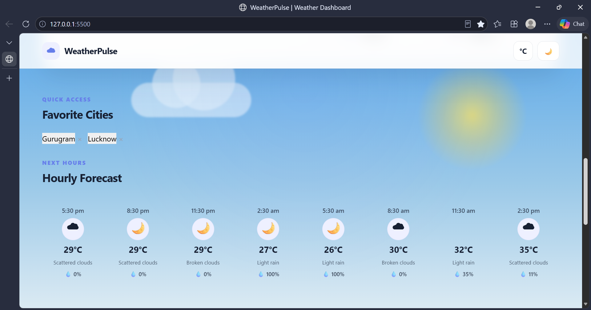

# WeatherPulse — Weather Application

A responsive weather application that fetches real-time weather information using the OpenWeatherMap API. Users can search for cities, view current weather conditions and forecasts, switch temperature units, use their current location, save favorite cities, and switch between light and dark themes.

## 🌐 Live Demo

[View WeatherPulse Live](https://06style.github.io/weather-app/)

## Project Overview

WeatherPulse is a frontend weather dashboard built using HTML, CSS, and JavaScript. It integrates REST APIs and asynchronous JavaScript to retrieve and display real-time weather data.

The application is designed with a clean, responsive interface that works across desktop, tablet, and mobile devices.

## Features

- Real-time current weather information
- City search
- City autocomplete suggestions
- 5-day weather forecast
- Celsius / Fahrenheit unit conversion
- Current location weather using browser geolocation
- Favorite cities using localStorage
- Weather data caching using localStorage
- Loading state while fetching data
- API error handling
- Light / dark theme
- Responsive design
- Weather condition icons
- Recent search storage
- Mobile-friendly interface

## Technologies Used

- HTML5
- CSS3
- JavaScript (ES6+)
- REST API
- OpenWeatherMap API
- Fetch API
- JSON
- Browser Geolocation API
- localStorage
- Git & GitHub

## API Used

This project uses the OpenWeatherMap API for weather data.

### APIs Used

- Current Weather API
- 5 Day / 3 Hour Forecast API
- Geocoding API
- Reverse Geocoding API

API documentation:

https://openweathermap.org/api

## Project Structure

```text
week4-weather-app/
│
├── index.html
│
├── css/
│   ├── style.css
│   ├── weather-icons.css
│   └── responsive.css
│
├── js/
│   ├── config.js
│   ├── storage.js
│   ├── weatherService.js
│   ├── ui.js
│   └── app.js
│
├── assets/
│   ├── icons/
│   └── images/
│
├── .env.example
├── .gitignore
└── README.md
```
## 📸 Screenshots

### 1. Main Weather Dashboard


### 2.  City Weather Report


### 3. Light Theme


### 4.  Favourite City & Hourly Forecast


### 5. 5-Day Forecast


### 6. Location Detection


